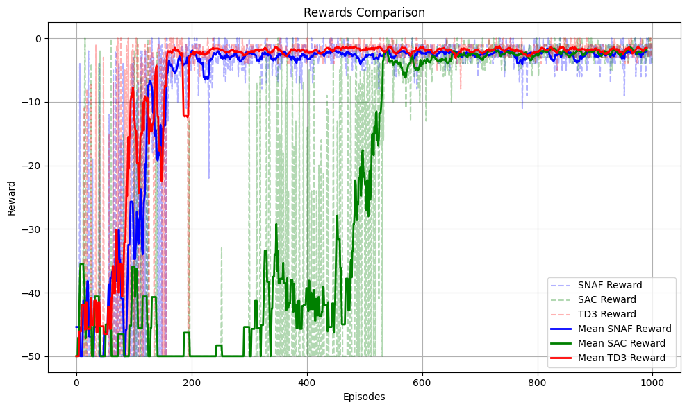

# Robotic Manipulation using Continuous Deep RL

This project focuses on training a 7 DOF robotic arm agent from the PandaReach-v3 environment available in the panda-gym toolkit. The PandaReach-v3 task involves controlling a robotic arm to reach target objects in a simulated environment.We explore advanced algorithms for continuous control: Soft Actor Critic (SAC), Normalized Advantage Function (NAF) and Twin Delayed Deep Deterministic Policy Gradient (TD3) to train the agent for this task. The models are designed to handle environments where actions are continuous, like controlling robotic arm joints with precision. These algorithms aim to discover policies that effectively map observed states to continuous actions, optimizing the accumulation of expected rewards. 

  

## Hindsight Experience Replay (HER)
Hindsight Experience Replay (HER) is a technique developed to tackle the challenge of sparse and binary rewards in reinforcement learning (RL) environments. In many robotic tasks, achieving the desired goal is rare, leading traditional RL algorithms to struggle with learning from such feedback. HER addresses this by repurposing past experiences for learning, regardless of whether they resulted in the desired goal. By relabeling failed attempts as succesful ones and storing both experiences in a replay buffer, the agent can learn from both successful and failed attempts, significantly improving the learning process.

## Results:

- The models are trained for 1000 episodes
- Average reward of the expert over 1000 episodes = -1.768

  
 

## References:
- Timothy P. Lillicrap, Jonathan J. Hunt, Alexander Pritzel, Nicolas Heess, Tom Erez, Yuval Tassa, David Silver, & Daan Wierstra. (2015). Continuous control with deep reinforcement learning.
- Scott Fujimoto, Herke van Hoof, & David Meger (2018). Addressing Function Approximation Error in Actor-Critic Methods. CoRR, abs/1802.09477.
- Quentin Gallouédec, Nicolas Cazin, Emmanuel Dellandréa, & Liming Chen. (2021). panda-gym: Open-source goal-conditioned environments for robotic learning.
- Marcin Andrychowicz, Filip Wolski, Alex Ray, Jonas Schneider, Rachel Fong, Peter Welinder, Bob McGrew, Josh Tobin, Pieter Abbeel, & Wojciech Zaremba. (2017). Hindsight Experience Replay.
- Abbeel, P. & Ng, A. Y. (2004). Apprenticeship learning via inverse reinforcement learning.
- Fujimoto, S., Hoof, H., & Meger, D. (2018). Addressing Function Approximation Error in Actor-Critic Methods. In International Conference on Machine Learning (pp. 1582–1591).
- Omkar Chittar. (n.d.). Omkarchittar/manipulator_control_DDPG - GitHub.